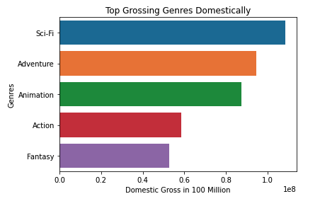
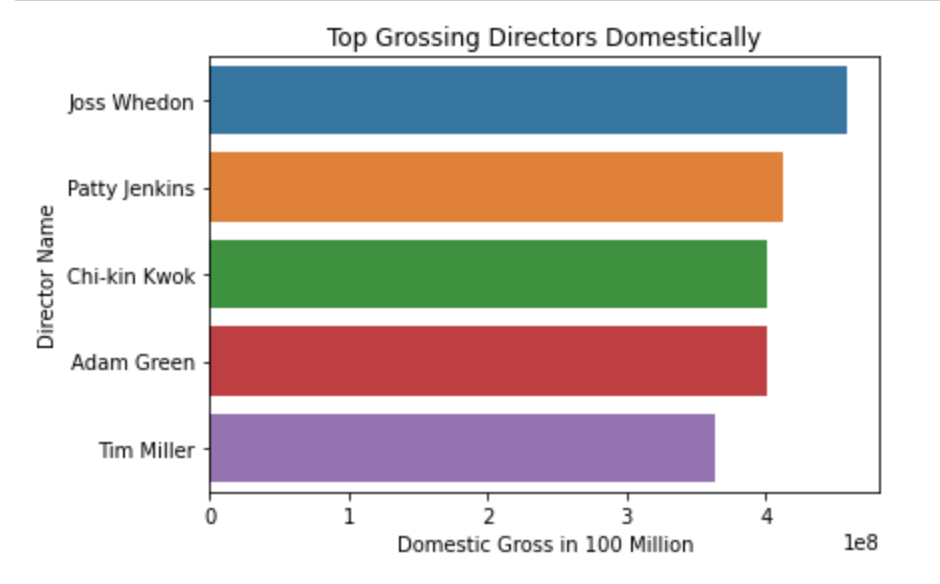
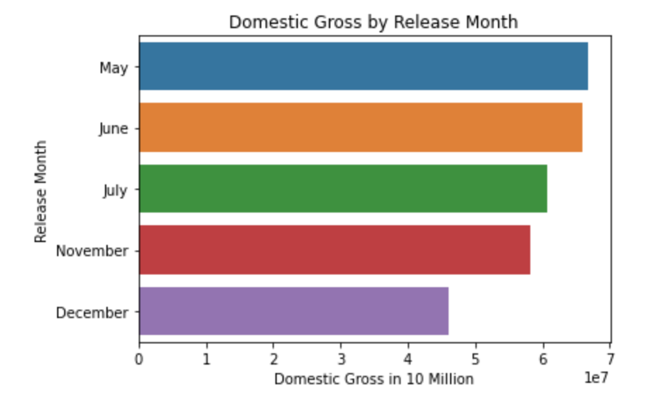

# Phase 1 Project 

## Microsoft Movie Studio Components Analysis

## Overview

The project is investigating and analyzing what components are needed to get 
started in the movie production business. We will be using the top grossing 
genres domestically, top grossing directors domestically and domestic gross 
by release month, this will show what genres of film to initially to make, 
which directors to use and when is a good time to release the film

### The Data & Methods

- Analysis of top grossing genres domestically joing imdb_title_basic and 
  bom_movie_gross datasets

- Analysis of top grossing directors domestically merging imdb_title_crew, 
  imdb_name_basics, and imbd_title_akas the top grossing genres dometically
  data set

- Analysis of domestic gross by release month by using tn_movie_budgets data set

### Data Analysis 1

>The analysis concludes that the three top grossing genres domestically are:
 
- Sci-Fi
- Adventure
- Animation

### Data Analysis 2

>The analysis concludes that the three top grossing directors domestically are:

- Joss Whedon
- Patty Jenkins
- Chi-kin Kwok

### Data Analysis 3

>The analysis concludes that the three top domestic gross by release month:

- May
- June
- July

### Conclusions

>These results/analysis shows insight towards three recommended steps in 
helping to choose what films should be created by the film studio 

-The three top grossing genres domestically are Sci-Fi, Adventure and Action films

   These genres are good starting points

-The top three top grossing directors domestically would be Joss Whedon, 
 Patty Jenkins and Chi-kin Kwok

   Going by their track records all three directors would be good fits to 
   direct film in the three top grossing genres mentioned above

-The top three domestic gross by release month would be May, June and July

   The seasonal launch release time for a film is crucial, Spring/Summer 
   seem to be common seasons associated with positive audience attendance to films 

### Other investigations

- once domestics releases are profitable, that's when the studio should 
  consider thinking about global film releases
- there may be overlapping data when considering top genre, director and 
  release month for a global market